# HLG

**Loop Gain estimation and analysis for sleep-disordered breathing.**

---

## Overview

**Loop gain (LG)** is a dimensionless measure of the sensitivity of the ventilatory control system. When LG is high (> 1), the respiratory controller over-corrects disturbances, producing self-sustaining oscillations in airflow — the hallmark of periodic breathing seen in central and obstructive sleep apnea.

The **HLG** package processes polysomnography (PSG) data to:

1. **Detect respiratory events** — apneas, hypopneas, and arousals from raw signals.
2. **Estimate loop gain** — fit a physiological Estimation Model (EM) to 8-minute segments of ventilation, extracting LG, controller gain (gamma), and plant delay (tau).
3. **Quantify self-similarity** — compute a Self-Similarity (SS) score that captures the periodicity of breathing patterns across the night.
4. **Predict treatment outcomes** — use per-patient LG distributions and clinical indices to predict CPAP treatment success via logistic regression.
5. **Visualise and report** — generate publication-quality figures and clinical summary reports.

This is a refactored version of the original single-file analysis scripts, reorganised into a modular Python package with clear separation of concerns.

---

## Package Structure

```
hlg_v2/
├── pyproject.toml
├── README.md
├── .gitignore
├── src/hlg/
│   ├── __init__.py
│   ├── config.py                  # Centralized configuration (HLGConfig dataclass)
│   ├── core/
│   │   ├── events.py              # find_events, events_to_array, window_correction, connect_events
│   │   ├── preprocessing.py       # do_initial_preprocessing, clip_normalize_signals
│   │   ├── ventilation.py         # compute_ventilation_envelopes, create_ventilation_trace
│   │   └── sleep_metrics.py       # compute_sleep_metrics (RDI, AHI, CAI)
│   ├── io/
│   │   ├── readers.py             # load_sim_output, load_SS_percentage
│   │   └── writers.py             # write_to_hdf5_file, write_to_mat_file
│   ├── ss/
│   │   ├── scoring.py             # convert_ss_seg_scores_into_arrays
│   │   ├── segmentation.py        # segment_data_based_on_nrem, compute_SS_score_per_segement
│   │   └── stable.py              # compute_osc_chains, compute_change_points_ruptures
│   ├── em/
│   │   ├── extraction.py          # extract_EM_output (parallel), process_EM_output
│   │   ├── postprocessing.py      # match_EM_with_SS_output, post_process_EM_output, add_arousals
│   │   ├── histograms.py          # compute_histogram, load_histogram_bars, predict_CPAP_SUCCESS_from_bars
│   │   └── loop_gain.py           # create_total_LG_array
│   ├── analysis/
│   │   ├── statistics.py          # quadratic_model, prediction_band, add_statistical_significance
│   │   ├── cpap.py                # compute_logistic_regression, bootstrapping, ROC/PR curves
│   │   ├── group.py               # extract_EM_output (sequential), cohort boxplots
│   │   ├── ss_relationship.py     # SS-vs-LG polynomial regression
│   │   └── altitude.py            # Altitude-level LG analysis
│   ├── visualization/
│   │   ├── segments.py            # plot_EM_output_per_segment
│   │   ├── full_night.py          # plot_full_night, add_LG_hooks
│   │   ├── histograms.py          # total_histogram_plot
│   │   └── stable_ss.py           # plot_SS, create_length_histogram
│   └── reporting.py               # save_output, create_report
├── scripts/
│   ├── run_em_extraction.py       # EM output extraction pipeline
│   ├── run_stable_ss.py           # Stable SS detection and plotting
│   ├── run_cpap_analysis.py       # CPAP treatment outcome prediction
│   └── run_group_analysis.py      # Cohort-level group comparisons
└── tests/
```

---

## Installation

Clone the repository and install in editable mode:

```bash
git clone <repository-url>
cd hlg_v2
pip install -e .
```

For development (includes pytest, ruff):

```bash
pip install -e ".[dev]"
```

### Requirements

- Python >= 3.10
- Core dependencies: numpy, pandas, scipy, matplotlib, scikit-learn, mne, h5py, hdf5storage, seaborn, uncertainties, ruptures

All dependencies are declared in `pyproject.toml` and installed automatically.

---

## Quick Start

### Loading a recording

```python
from hlg.io.readers import load_sim_output

data, hdr = load_sim_output("path/to/recording.hf5")
print(hdr["patientTag"], "—", hdr["testType"])
print(data.columns.tolist())
```

### Preprocessing signals

```python
from hlg.core.preprocessing import do_initial_preprocessing, clip_normalize_signals

data, hdr = do_initial_preprocessing(data, hdr)
data = clip_normalize_signals(data, hdr)
```

### Computing ventilation

```python
from hlg.core.ventilation import compute_ventilation_envelopes, create_ventilation_trace

data = compute_ventilation_envelopes(data, hdr)
data = create_ventilation_trace(data, hdr)
```

### Detecting respiratory events

```python
from hlg.core.events import find_events

events = find_events(data["apnea_mask"].values)
# Returns list of (start_sample, end_sample) tuples
```

### Running the EM extraction pipeline

```python
from hlg.em.extraction import extract_EM_output

extract_EM_output(
    input_files, interm_folder, hf5_folder,
    version, dataset, csv_file, bar_folder
)
```

### Using the entrypoint scripts

```bash
# EM output extraction (parallel processing)
python -m scripts.run_em_extraction

# Stable self-similarity analysis
python -m scripts.run_stable_ss

# CPAP treatment outcome prediction
python -m scripts.run_cpap_analysis

# Cohort-level group comparisons
python -m scripts.run_group_analysis
```

---

## Architecture

The data flows through a layered pipeline. Lower layers have no dependencies on higher layers.

```mermaid
flowchart TD
    subgraph "Layer 0 — Configuration"
        CONFIG[config.py<br/>HLGConfig]
    end

    subgraph "Layer 1 — Core Primitives"
        EVENTS[core/events.py]
        PREPROC[core/preprocessing.py]
        VENT[core/ventilation.py]
        METRICS[core/sleep_metrics.py]
    end

    subgraph "Layer 2 — I/O"
        READERS[io/readers.py]
        WRITERS[io/writers.py]
    end

    subgraph "Layer 3 — SS Pipeline"
        SCORING[ss/scoring.py]
        SEGMENTATION[ss/segmentation.py]
        STABLE[ss/stable.py]
    end

    subgraph "Layer 4 — EM Pipeline"
        EXTRACTION[em/extraction.py]
        POSTPROC[em/postprocessing.py]
        HISTOGRAMS[em/histograms.py]
        LOOPGAIN[em/loop_gain.py]
    end

    subgraph "Layer 5 — Analysis"
        STATS[analysis/statistics.py]
        CPAP[analysis/cpap.py]
        GROUP[analysis/group.py]
        SSREL[analysis/ss_relationship.py]
        ALTITUDE[analysis/altitude.py]
    end

    subgraph "Layer 6 — Visualization & Reporting"
        VIZ_SEG[visualization/segments.py]
        VIZ_FN[visualization/full_night.py]
        VIZ_HIST[visualization/histograms.py]
        VIZ_SS[visualization/stable_ss.py]
        REPORT[reporting.py]
    end

    subgraph "Entrypoints"
        S1[run_em_extraction.py]
        S2[run_stable_ss.py]
        S3[run_cpap_analysis.py]
        S4[run_group_analysis.py]
    end

    CONFIG --> PREPROC
    CONFIG --> SEGMENTATION
    CONFIG --> EXTRACTION

    EVENTS --> VENT
    EVENTS --> METRICS
    PREPROC --> VENT

    READERS --> EXTRACTION
    READERS --> STABLE
    WRITERS --> REPORT

    SCORING --> EXTRACTION
    SEGMENTATION --> EXTRACTION

    EXTRACTION --> GROUP
    POSTPROC --> EXTRACTION
    HISTOGRAMS --> CPAP
    LOOPGAIN --> EXTRACTION

    STATS --> GROUP
    STATS --> SSREL
    STATS --> ALTITUDE

    S1 --> EXTRACTION
    S2 --> STABLE
    S2 --> VIZ_SS
    S3 --> CPAP
    S3 --> HISTOGRAMS
    S4 --> GROUP
    S4 --> STATS
```



---

## Module Reference

Mapping from the original single-file scripts to the refactored package modules:

| Original file | New module(s) | Key functions |
|---|---|---|
| `EM_output_extraction.py` | `hlg.em.extraction` | `extract_EM_output`, `process_EM_output` |
| `EM_output_post_processing.py` | `hlg.em.postprocessing` | `match_EM_with_SS_output`, `post_process_EM_output`, `add_arousals` |
| `EM_output_to_CPAP_Analysis.py` | `hlg.analysis.cpap` | `compute_logistic_regression`, `compute_calibration_curve` |
| `EM_output_to_Group_Analysis.py` | `hlg.analysis.group` | `extract_EM_output` (sequential variant) |
| `EM_output_to_Altitude_Relationship.py` | `hlg.analysis.altitude` | Altitude-level LG analysis |
| `EM_output_to_SS_Relationship.py` | `hlg.analysis.ss_relationship` | SS-vs-LG polynomial regression |
| `SS_output_to_EM_input.py` | `hlg.ss.segmentation` | `segment_data_based_on_nrem`, `compute_SS_score_per_segement` |
| `Convert_SS_seg_scores.py` | `hlg.ss.scoring` | `convert_ss_seg_scores_into_arrays` |
| `Stable_SS_analysis.py` | `hlg.ss.stable` | `compute_osc_chains`, `compute_change_points_ruptures` |
| `Save_and_Report.py` | `hlg.reporting` | `save_output`, `create_report` |
| `Initial_preprocessing.py` | `hlg.core.preprocessing` | `do_initial_preprocessing`, `clip_normalize_signals` |
| `Ventilation.py` | `hlg.core.ventilation` | `compute_ventilation_envelopes`, `create_ventilation_trace` |
| `Sleep_metrics.py` | `hlg.core.sleep_metrics` | `compute_sleep_metrics` |
| `Find_events.py` | `hlg.core.events` | `find_events`, `events_to_array`, `window_correction` |
| `Plot_full_night.py` | `hlg.visualization.full_night` | `plot_full_night`, `add_LG_hooks` |
| `Plot_per_segment.py` | `hlg.visualization.segments` | `plot_EM_output_per_segment` |
| Various histogram code | `hlg.em.histograms`, `hlg.visualization.histograms` | `compute_histogram`, `total_histogram_plot` |
| Various statistics code | `hlg.analysis.statistics` | `quadratic_model`, `prediction_band`, `add_statistical_significance` |

---

## Configuration

All tunable parameters are centralised in the `HLGConfig` dataclass (`hlg/config.py`). A module-level singleton is available for direct import:

```python
from hlg.config import config

# Access defaults
print(config.default_fs)          # 10 Hz
print(config.error_threshold)     # 1.8
print(config.ss_threshold)        # 0.5
print(config.segment_block_size_min)  # 8 minutes
```

### Key parameters

| Parameter | Default | Description |
|---|---|---|
| `default_fs` | `10` | Target sampling rate (Hz) after downsampling |
| `notch_freq_us` | `60.0` | US powerline notch filter frequency (Hz) |
| `bandpass_freq_eeg` | `(0.1, 20.0)` | EEG bandpass filter range (Hz) |
| `bandpass_freq_breathing` | `(0.0, 10.0)` | Respiratory bandpass filter range (Hz) |
| `error_threshold` | `1.8` | RMSE threshold for EM segment rejection |
| `ss_threshold` | `0.5` | SS convolution score threshold for periodic breathing |
| `segment_block_size_min` | `8` | EM input segment length (minutes) |
| `csv_dir` | `"csv_files"` | Path to CSV metadata tables |
| `hf5_dir` | `""` | Path to HDF5 recording files |
| `output_dir` | `"output"` | Default output directory |

### Environment variable overrides

File paths can be overridden via environment variables without modifying code:

```bash
export HLG_CSV_DIR="/data/clinical/csv"
export HLG_HF5_DIR="/data/recordings"
export HLG_OUTPUT_DIR="/results/output"
```

---

## Data Formats

### HDF5 Recording Files (`.hf5`)

Each `.hf5` file contains a single night's processed polysomnography recording, produced by the Self-Similarity analysis pipeline. The file uses a flat HDF5 layout with two types of datasets:

**Time-series channels** (length = number of samples at `newFs`):

| Channel | Description |
|---|---|
| `abd` / `chest` | Respiratory effort (abdominal/thoracic belt) |
| `flow` | Nasal airflow signal |
| `spo2` | Oxygen saturation (SpO2) |
| `ss_conv_score` | Self-similarity convolution score (0–1) |
| `apnea_mask` | Binary apnea/hypopnea event mask |
| `stage` | Sleep stage labels (W=0, N1=1, N2=2, N3=3, REM=5) |

**Scalar metadata** (stored as length-1 datasets):

| Field | Description |
|---|---|
| `patientTag` | Unique recording identifier |
| `testType` | Study type (e.g., `"PSG"`, `"split-night"`) |
| `newFs` | Sampling rate of the stored signals |
| `lights_off` / `lights_on` | Recording boundaries (sample indices) |

The `load_sim_output` function in `hlg.io.readers` handles the full loading pipeline, including the chest-to-abdomen fallback and metadata extraction.

### Intermediate CSV Files

EM extraction produces per-cohort CSV files in the `interm_Results/` directory containing per-segment metrics:

| Column | Description |
|---|---|
| `LG_data` | Loop gain estimate for the segment |
| `G_data` | Controller gain (gamma) |
| `D_data` | Plant delay (tau, seconds) |
| `valid_data` | Boolean flag for segments passing RMSE threshold |
| `ID_data` | Patient identifier |
| `SS_score` | Mean self-similarity score for the segment |

---

## Development

### Running tests

```bash
pip install -e ".[dev]"
uvrun python -m pytest tests/ -s
```

### Code style

The project uses [Ruff](https://docs.astral.sh/ruff/) for linting with a line length of 120 characters:

```bash
ruff check src/
ruff format src/
```

### Adding a new analysis

1. Place the core computation in the appropriate subpackage (`analysis/`, `em/`, `ss/`).
2. Add any new plotting functions to `visualization/`.
3. If the analysis needs a new entrypoint, create a script in `scripts/`.
4. Import only from lower layers — see the architecture diagram for allowed dependencies.

---

## License

MIT
